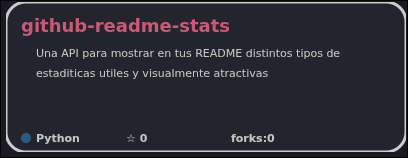
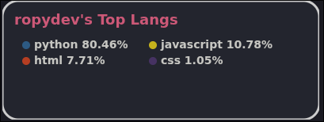

# Github Readme Stats
Inspirado en el repositorio 

**Github Readme Stats** es una **API** creada en **Python** utilizando **FastAPI** con la cual puedes mostrar distintos badges y estadisticas visualmente en los readme de tu github

## Funciones
### **/repos/pin**



Este endpoint permite mostrar una targeta con informacion basica de un repositorio
<br>
Argumentos que recibe el endpoint:
```
Obligatorios:
username      # nombre del usuario al que pertenece el repo
repo          # nombre del repositorio

Opcionales:
titleColor    # color del nombre del repositorio
bgColor       # color del fondo de la targeta ej: bgColor=FFFFFF
color         # color del texto de la targeta
borderColor   # color del borde ej: borderColor=000000
borderWidth   # ancho del borde
borderHide    # si quieres mostrar el borde
theme         # tema predefinido ej: dracula
```
Ejemplos de uso:
```
repos/pin?username=ropydev&repo=github-readme-stats&bgColor=000000&color=FFFFFF&borderColor=FFFFFF
repos/pin?username=ropydev&repo=github-readme-stats&bgColor=000000&color=FFFFFF&borderHide=True
repos/pin?username=ropydev&repo=github-readme-stats&theme=dracula
```

### **/stats/commits-activity**

Este endpoint permite mostrar una grafica estetica segun los ultimos 30 dias de commits del usuario
<br>
Argumentos que recibe el endpoint:
```
Obligatorios:
username      # el nombre del usuario deseado

Opcionales:
title         # el titulo a mostrar de la grafica (por defecto "Commits Activity")
theme         # tema predefinido ej: dracula
titleColor    # color del titulo de la grafica
bgColor       # color del fondo de la grafica
color         # color del texto
```
Ejemplos de uso:
```
/stats/commits-activity?username=ropydev
/stats/commits-activity?username=ropydev&title=Example
```

### Top Langs 



Este endpoint permite mostrar una targeta com mas de 60 temas disponibles con los lenguajes que usa un usuario y sus porcientos de uso
<br>
Argumentos que recibe el endpoint:
```
Obligatorios:
username      # el nombre del usuario deseado

Opcionales:
theme         # tema predefinido ej: dracula
titleColor    # color del titulo de la grafica
bgColor       # color del fondo de la grafica
color         # color del texto
```
Ejemplos de uso:
```
/top/langs?username=ropydev&theme=dark
/top/langs?username=ropydev&bgColor=000000&color=ffffff&titleColor=ffffff
```

## Instalacion y Uso
```
git clone https://github.com/ropydev/github-readme-stats
cd github-readme-stats
pip install -r requirements.txt
python -m uvicorn src.main:app --reload
```
Esos comandos de consola descargan el repositorio usando git, instala sus dependencias y abre la api en local en 
<code>http://127.0.0.1:8000/</code> importante que sea src.main y no solo main
